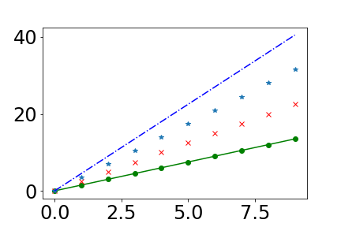
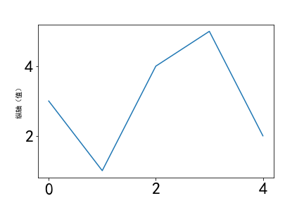
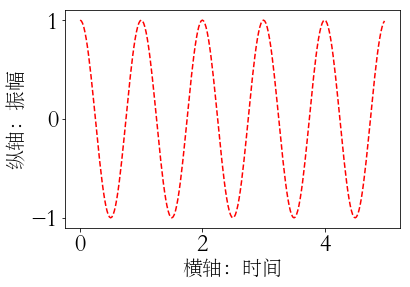
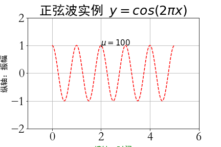
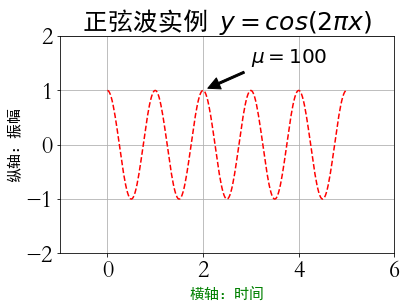
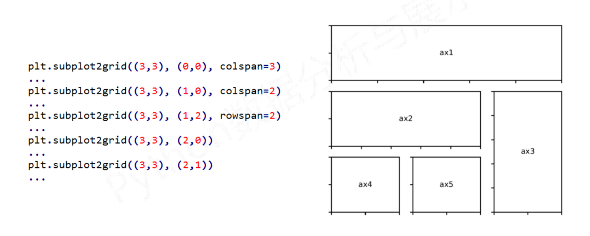
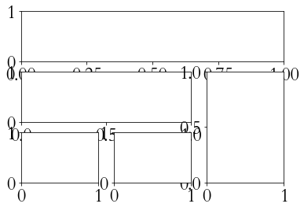

# plt.plot(x, y, format_string, **kwargs)

## 参数含义
* x: X轴数据，列表或数组，可选
* y: Y轴数据，列表或数组
* format——string: 控制曲线的合适字符串，可选。
* \*\*kwargs: 第二组或更多(x, y, format_string) __当绘制多条曲线时，各条曲线的x不能省略。__
    * color:控制颜色， color='green'
    * linestyle:线条风格，linestyle='dashed'
    * marker:标记风格，marker='o'
    * markerfacecolor:标记颜色，markerfacecolor-'blue'
    * markersize:标记尺寸，markersize=20


```python
import matplotlib.pyplot as plt
import numpy as np

a = np.arange(10)
plt.plot(a, a*1.5, 'go-', a, a*2.5, 'rx', a, a*3.5, '*', a, a*4.5, 'b-.')
plt.show()
```


_注意pyplotm默认不支持中文显示_

## pyplot的中文显示

### 方法一：reParams修改字体实现

* 'font.family' 用于显示字体的名字
* 'font.style' 字体风格，正常'normal'或斜体'italic'
* 'font.size' 字体大小，整数字号或者'large','x-small'

```python
import matplotlib.pyplot as plt
import matplotlib

matplotlib.rcParams['font.family']='SimHei'
plt.plot([3,1,4,5,2])
plt.ylabel("纵轴（值）")
plt.show()

```


### 方法二：在有中文输出的地方，增加一个属性：fontproperties（推荐）
```python
import matplotlib.pyplot as plt
import matplotlib

a = np.arange(0.0, 5.0, 0.02)
plt.xlabel("横轴：时间", fontproperties='STSong', fontsize=20)
plt.ylabel("纵轴：振幅", fontproperties='STSong', fontsize=20)
plt.plot(a, np.cos(2*np.pi*a), 'r--')
plt.show()
```


## pyplot的文本显示
* plt.xlabe() 对X轴增加文本标签
* plt.ylabe() 对Y轴增加文本标签
* plt.title() 对图形整体增加文本标签
* plt.text() 在任意位置增加文本
* plt.annotate() 在图形中增加带箭头的注释
    plt.annotate(s, xy=arrow_crd, xytext=text_crd, arrowprops=dict)
    * s 要注解的字符串
    * xy 箭头所在的位置
    * xytext 文本显示的位置
    * arrowprops 字典类型，定义箭头属性

```python
a = np.arange(0.0, 5.0, 0.02)
plt.plot(a, np.cos(2*np.pi*a), 'r--')
plt.xlabel("横轴：时间", fontproperties='SimHei', fontsize=15, color='green')
plt.ylabel("纵轴：振幅", fontproperties='SimHei', fontsize=15)
plt.title(r'正弦波实例 $y=cos(2\pi x)$', fontproperties='SimHei', fontsize=25)
plt.text(2, 1, r'$\mu=100$', fontsize=15)
plt.grid([-1, 6, -2, 2])
plt.grid(True)
plt.show()
```


```python
# 将plt.title()替换为：
plt.annotate(r'$\mu=100$', xy=(2, 1), xytext=(3, 1.5), 
             arrowprops=dict(facecolor='black', shrink=0.1, width=2))
```


## pyplot的子绘图区域

### plt.subplot2grid(GridSpec, CurSpec, colspan=1, rowspan=1)辅助subplot设计子区域
理念：设定网格，选中网格，确定选中行列区域数量，编号从0开始
plt.subplot2grid((3,3),(1,0),colspan=2)
* GridSpec 元组，将区域分割为几行几列
* CurSpec 元组，为subplot选定的区域的位置
* colspan 列的延申
* rowspan 行的延申



### GridSpec类:matplotlib中用于子区域设计和选定的类

```python
import matplotlib.pyplot as plt
import matplotlib.gridspec as gridspec

gs = gridspec.GridSpec(3, 3)

ax1 = plt.subplot(gs[0, :])
ax2 = plt.subplot(gs[1, :-1])
ax3 = plt.subplot(gs[1:, -1])
ax3 = plt.subplot(gs[2, 0])
ax5 = plt.subplot(gs[2, 1])
```

